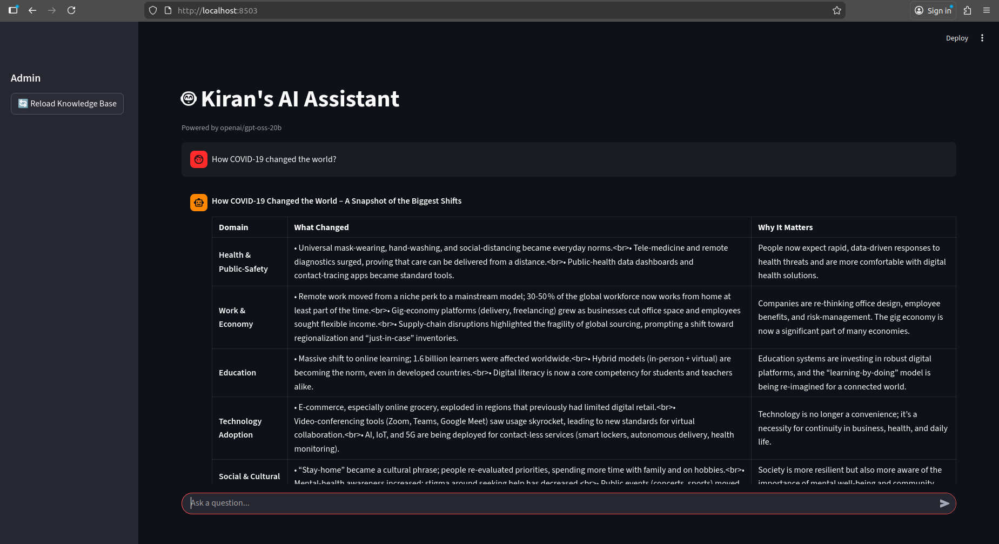
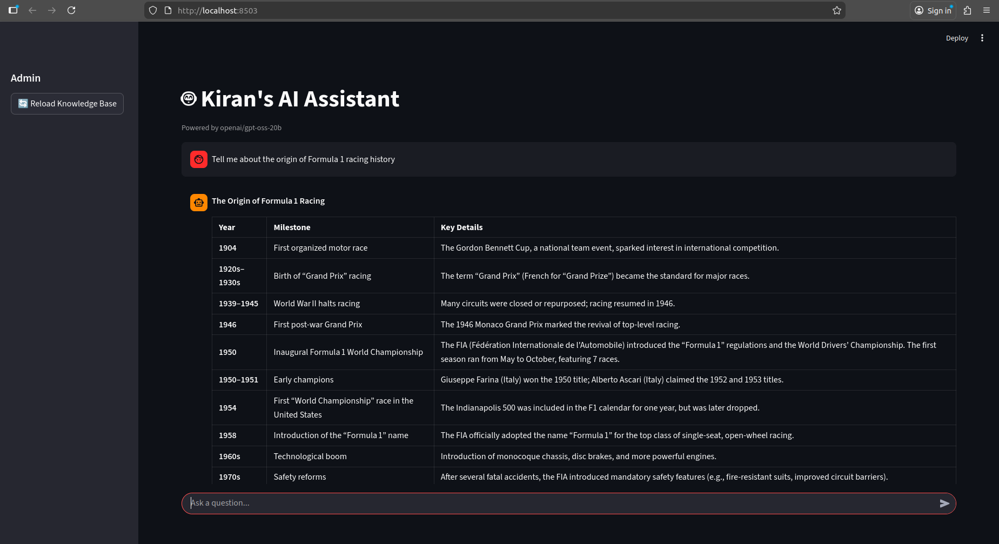

# Multi-Agent RAG & Web Search System 🤖🔍

A powerful multi-agent framework designed to handle complex queries by combining **Retrieval-Augmented Generation (RAG)** with real-time **Web Search** capabilities. This system uses specialized agents to decide when to look at local documents and when to fetch live information from the internet.

# RAG capability

# Web search capability

## 🚀 Features

- **Multi-Agent Orchestration:** Uses a supervisor or autonomous agents to delegate tasks.
- **RAG Integration:** Efficiently retrieves context from your local knowledge base (PDFs, Text, etc.).
- **Real-time Web Search:** Integrates with tools (Tavily) to provide up-to-date answers.
- **Smart Routing:** Automatically determines whether a query requires local data or a web search.
- **Persistent Memory:** Remembers previous interactions in a conversation.

## 🛠️ Tech Stack

- **Framework:** [LangGraph, LangChain]
- **LLM:** [openai/gpt-oss-20b from Groq API]
- **Vector Database:** [ChromaDB]
- **Search Tool:** [Tavily API]
- **UI:** [Streamlit]

## 📋 Prerequisites

Before running the project, ensure you have:
- Python 3.11
- API Keys for:
  - Groq 
  - Tavily 

This project uses `uv` as the python package manager

### Install uv:

`curl -LsSf https://astral.sh/uv/install.sh | sh`

### Verify the installation:

`uv --version`

## Clone the repository or Download as zip file

`https://github.com/yoursrealkiran/multi_agent.git`

`cd multi_agent`

## Environment Setup

### Create a Virual Environment

#### In the terminal, run the below command to create a virtual environment

`uv venv`

#### Activate the environment

`source .venv/bin/activate`

#### Install Dependencies

`uv sync`

## Running the Application

`cd multi_agent/src`

`uv run streamlit run main.py`
